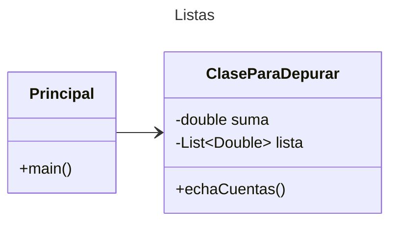

## Proyecto - Listas

Plantilla básica para proyecto de Java

# Diagrama de clases
[Editor en línea](https://mermaid.live/)

[Referencia-Mermaid](https://mermaid.js.org/syntax/classDiagram.html)

* Ejecutar

```
gradle run
```
* Probar

```
gradle test
```
* Generar el Diagrama de Secuencia 

```
gradle appmap test
```
El Diagrama de Secuencia se puede consultar en `/app/build/appmap/junit/**.json`

[Referencia Appmap.io](https://appmap.io/)

Los comandos anteriores están considerados para un ambiente Linux

